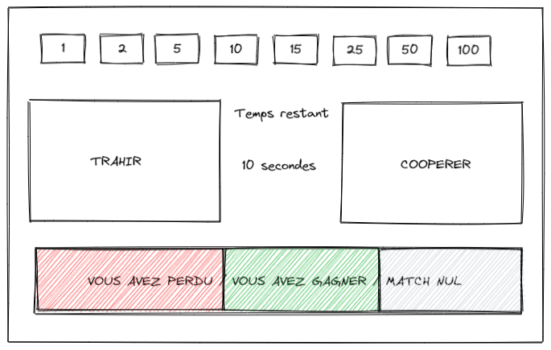

# Prisoner's Dilemma

## Build requirements

```bash
apt install build-essential doxygen graphviz libgtk-3-dev
```

## Build & run

```bash
git clone https://github.com/ccouriol/prisonersdilemma.git
cd prisonersdilemma/

### To compile and run the program :
make run

### To compile the program and run manually :
make && ./output/main

### To compile and build the documentation
make doc
./docs/html/index.html

### To clean the docs and program
make clean
```

## Mockup

[Excalidraw mockup](https://excalidraw.com/#json=s0DXZXyjgY25yq5YDQ9gv,wePrsjqY_j_UPpj-NZa47A)



## Todo

- [ ] Server config
- [ ] Client config
- [ ] Explain prisoner's dilmena
- [ ] Explain context
- [ ] Build depedencies for config files
